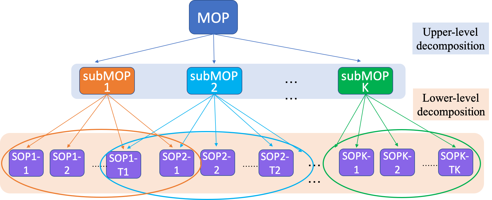

# **MOEA/D-BL**

MOEA/D-BL is a bio-inspired algorithm for multi/many-objective optimisation through a bilevel decomposition framework. MOEA/D-BL is essentially a derivative of MOEA/D (Zhang & Li, 2007), but it differs in the way how subproblems are created. It borrows the idea of M2M (Gu et al, 2014) to decompose an MOP into a sequence of subMOPs, and subMOPs are further broken down into scalar subproblems. Importantly, MOEA/D-BL allows neighboring subMOPs to shar subproblems so that positive information from one subMOP can be propagated into another and finally to all the subMOPs.

# ***How to use***
MOEA/D-BL is implemented in MATALB compatible with the popular PlatEMO platform for algorithm comparison and analysis. It can be directly added into PlatEMO 1.5 as a package for instant use. It may need some changes if you use other versions of PlatEMO.
